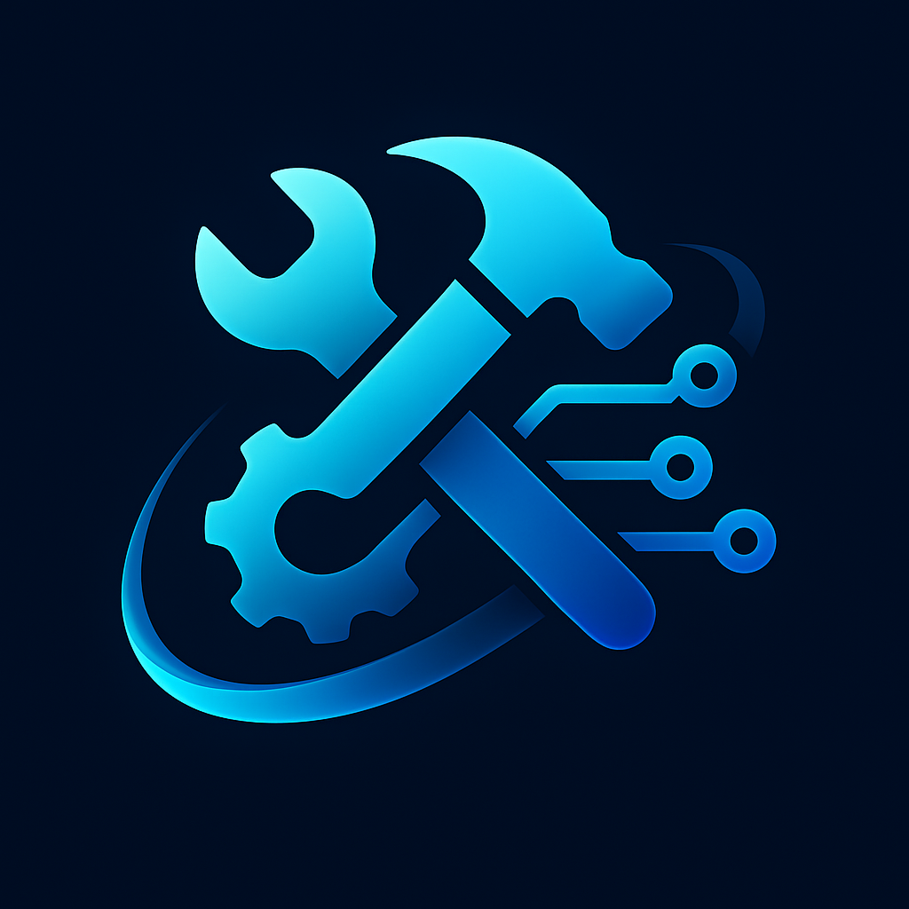

# William Bova

### Building automation tools, production web apps, and desktop applications.

I help businesses move faster by turning manual workflows, messy data, and rough ideas into usable software.

 

 

 

---

## 👋 About

I build practical software for small businesses, internal teams, and founder-led projects.

Most of my work focuses on improving workflows, organizing data, reducing repetitive tasks, and giving teams cleaner tools to operate with. My strongest work is often private or client-facing, so this profile highlights the systems I build, the stack I use, and the areas I am actively developing in.

---

## 🚀 What I Build

* 🌐 Production websites and web applications
* ⚙️ Workflow automation tools
* 🤖 AI-assisted internal tools
* 🗂️ CRM and data-cleaning systems
* 💻 Desktop applications
* 📊 Lightweight dashboards and operational tools
* 🧩 Client-facing business software
* 🎨 Front-end rebuilds for small businesses and growing brands

---

## 🧱 Featured Work

### TaskedBy 🛠️

Founder of **TaskedBy**, an automation and web development studio focused on helping small businesses modernize websites, reduce repetitive work, and launch better digital tools.

### Client Web Projects 🌐

Built and deployed websites, landing pages, and front-end rebuilds for businesses across food, golf, finance, local services, and consumer brands.

### Desktop Applications 💻

Built and packaged desktop applications for internal workflows, business operations, and productivity-focused use cases.

### AI + Automation Tools 🤖

Built tools that use AI-assisted workflows to support data cleanup, content processing, internal operations, and business productivity.

---

## 🧰 Current Stack

### Languages & Frameworks

`Python` `JavaScript` `HTML` `CSS` `React` `Next.js` `Flask`

### Backend & Data

`Supabase` `Postgres` `REST APIs` `CSV/XLSX Processing`

### AI & Automation

`OpenAI API` `Claude` `AI-Assisted Development` `Prompt Engineering` `Workflow Automation`

### Deployment & Tools

`Vercel` `GitHub` `Desktop App Packaging` `API Integrations`

---

## 🔍 Currently Interested In

* 🤖 AI-powered business tools
* 🏢 Internal software for small teams
* ⚙️ Automation-first workflows
* 🎨 Clean front-end experiences
* 💻 Desktop application deployment
* 🗂️ CRM and data workflow systems
* ✨ Turning rough ideas into polished products

---

## 🤝 Work Style

I like building software that is useful, simple to understand, and easy to improve over time.

I care about:

* ✨ Clean interfaces
* ⚙️ Practical automation
* 🧭 Clear user flows
* 🚀 Fast iteration
* 🛠️ Shipping working products
* 📈 Tools that solve real business problems

---

## 📬 Contact

Portfolio, demos, work samples, and project inquiries available upon request.

**Email:** [william@taskedby.com](mailto:william@taskedby.com)
**Website:** [taskedby.com](https://taskedby.com)

